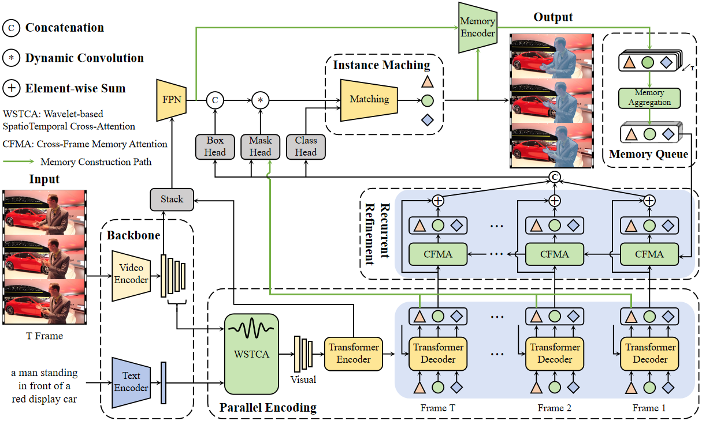

# FPR-Former: A Frequency-Aware Parallel-Recurrent Transformer for Referring Video Object Segmentation

[](https://youtu.be/8S9NJEE3JMo)

## 📖 Abstract

**FPR-Former** is a frequency-aware parallel-recurrent Transformer designed for Referring Video Object Segmentation (RVOS). It addresses the dual challenges of semantic ambiguity in cross-modal alignment and the architectural trade-off between multi-frame processing efficiency and temporal consistency. The core design integrates the **Wavelet-based SpatioTemporal Cross-Attention (WSTCA)** module, which decouples visual features into frequency sub-bands to enable precise linguistic-visual alignment and construct a compact feature foundation. Building on this, the **Recurrent Memory Refinement (RMR)** module utilizes **Cross-Frame Memory Attention (CFMA)** and inherent parameter sharing to ensure robust temporal consistency without the overhead of bulky global modeling. Consequently, FPR-Former achieves highly competitive performance across five major benchmarks (e.g., Ref-YouTube-VOS, Ref-DAVIS17) with **fewer trainable parameters**.

## 📘 FrameWork



## 🛠️ Environment Setup

- install pytorch `pip install torch==1.11.0+cu113 torchvision==0.12.0+cu113 torchaudio==0.11.0 --extra-index-url https://download.pytorch.org/whl/cu113`
- install other dependencies `pip install h5py opencv-python protobuf av einops ruamel.yaml timm joblib pandas matplotlib cython scipy`
- install transformers numpy `pip install transformers==4.24.0` `pip install numpy==1.23.5`
- install pycocotools `pip install -U 'git+https://github.com/cocodataset/cocoapi.git#subdirectory=PythonAPI'`
- build up MultiScaleDeformableAttention

```
cd ./models/ops
python setup.py build install
```

- install torch_dwt for DWT3D，IDWT3D

```
git clone https://github.com/KeKsBoTer/torch-dwt
cd torch-dwt
pip install -e .
```

## 🧾 Data Preparation

Please refer to [Referformer](https://github.com/wjn922/ReferFormer/blob/main/docs/data.md) for data preparation. The Overall data preparation is set as followed. 

```
rvosdata
└── a2d_sentences/ 
    ├── Release/
    │   ├── videoset.csv  (videos metadata file)
    │   └── CLIPS320/
    │       └── *.mp4     (video files)
    └── text_annotations/
        ├── a2d_annotation.txt  (actual text annotations)
        ├── a2d_missed_videos.txt
        └── a2d_annotation_with_instances/ 
            └── */ (video folders)
                └── *.h5 (annotations files)
└── refer_youtube_vos/ 
    ├── train/
    │   ├── JPEGImages/
    │   │   └── */ (video folders)
    │   │       └── *.jpg (frame image files) 
    │   └── Annotations/
    │       └── */ (video folders)
    │           └── *.png (mask annotation files) 
    ├── valid/
    │   └── JPEGImages/
    │       └── */ (video folders)
    |           └── *.jpg (frame image files) 
    └── meta_expressions/
        ├── train/
        │   └── meta_expressions.json  (text annotations)
        └── valid/
            └── meta_expressions.json  (text annotations)
└── mevis/
    ├── train/
    │   ├── JPEGImages/
    │   │   └── */ (video folders)
    │   │       └── *.jpg (frame image files) 
    │   ├── mask_dict.json
    │   └── meta_expressions.json              
    ├── valid/
    │   ├── JPEGImages/
    │   │    └── */ (video folders)
    |   │        └── *.jpg (frame image files) 
    │   └── meta_expressions.json              
    └── valid_u/
        ├── JPEGImages/
        │   └── */ (video folders)
        │       └── *.jpg (frame image files) 
        ├── mask_dict.json
        └── meta_expressions.json  
└── coco/
      ├── train2014/
      ├── refcoco/
        ├── instances_refcoco_train.json
        ├── instances_refcoco_val.json
      ├── refcoco+/
        ├── instances_refcoco+_train.json
        ├── instances_refcoco+_val.json
      ├── refcocog/
        ├── instances_refcocog_train.json
        ├── instances_refcocog_val.json
```

## Pretrained Model

We create a folder for storing all pretrained model and put them in the path ./pretrained, please change to xxx/pretrained according to your own path.

```
pretrained
└── pretrained_swin_transformer
└── pretrained_roberta
```

- For pretrained_swin_transformer folder download [Video-Swin-Base](https://github.com/SwinTransformer/storage/releases/download/v1.0.4/swin_base_patch244_window877_kinetics400_22k.pth)
- For pretrained_roberta folder download config.json pytorch_model.bin tokenizer.json vocab.json from huggingface (roberta-base)

## Model Zoo

The checkpoints are as follows:

| Setting           | Backbone     | Checkpoint                                                   |
| ----------------- | ------------ | ------------------------------------------------------------ |
| a2d_from_scratch  | Video-Swin-T | [Model](https://drive.google.com/file/d/1JflNxlpUW__b_hRcmtl030lO2m5QTCOy/view?usp=drive_link) |
| a2d_with_pretrain | Video-Swin-T | [Model](https://drive.google.com/file/d/1KL6BFEGlTx83vLVOqcDwvit_NJCaiQty/view?usp=drive_link) |
| a2d_with_pretrain | Video-Swin-B | [Model](https://drive.google.com/file/d/1wyD8reQQYf51L5jbjlx7n-xslF_WZrrF/view?usp=drive_link) |
| ytb_from_scratch  | Video-Swin-T | [Model](https://drive.google.com/file/d/1yH8-Qur7o1N3DAQk07Srcw67hcoQ9MKv/view?usp=drive_link) |
| ytb_with_pretrain | Video-Swin-T | [Model](https://drive.google.com/file/d/19CTI9oMuwKcWRgDeIVOL_l6-II74rkbq/view?usp=drive_link) |
| ytb_with_pretrain | Video-Swin-B | [Model](https://drive.google.com/file/d/1IIWTPrvKgyKJX3zQy26ouBAv01kFbE_a/view?usp=drive_link) |
| mevis_with_pretrain | Video-Swin-T | [Model](https://drive.google.com/file/d/1_WZhNF6FxcP9TOX3HkHaqyjT-0cB2czQ/view?usp=drive_link) |
| coco_pretrain     | Video-Swin-T | [Model](https://drive.google.com/file/d/13BT7WUGgHcKg0DhclKgiqltkMFUgwyZq/view?usp=drive_link) |
| coco_pretrain     | Video-Swin-B | [Model](https://drive.google.com/file/d/1lfdC8pU9uEY3XgO0xdHAdVMnVPa3tFUt/view?usp=drive_link) |

## Inference

We provide inference scripts for multiple RVOS benchmarks. Before running, please make sure:

1. The environment is set up correctly (see [Environment Setup](#-environment-setup)).
2. The pretrained backbone weights are placed under `./pretrained/` (see [Pretrained Model](#pretrained-model)).
3. The model checkpoint is downloaded from [Model Zoo](#model-zoo).

### Ref-DAVIS17

Please refer to [ReferFormer](https://github.com/wjn922/ReferFormer/blob/main/docs/data.md) to prepare the Ref-DAVIS dataset. Set the `davis_path` in `configs/davis.yaml` to your dataset root path.

```bash
python3 infer_davis.py \
    -c configs/davis.yaml \
    -rm test \
    --version "davis_tiny_finetune_ytb" \
    -ng 1 \
    --backbone "video-swin-t" \
    -bpp "pretrained/pretrained_swin_transformer/swin_tiny_patch244_window877_kinetics400_1k.pth" \
    -ckpt "checkpoints/finetune_ytb_tiny.pth.tar"
```

Or simply run:

```bash
bash ./scripts/infer_davis.sh
```

The results will be saved under `results/runs/davis/<version>/`. To evaluate, use the DAVIS evaluation toolkit:

```bash
python3 eval_davis.py --results_path "results/runs/davis/davis_tiny_finetune_ytb/anno_0"
```

The script generates predictions for all 4 annotators (`anno_0` to `anno_3`). Add `--visualize` to save visualization images.

### Refer-YouTube-VOS

Set the `img_folder` in `configs/refer_youtube_vos.yaml` to your dataset root path (e.g., `rvosdata/refer_youtube_vos`).

```bash
python3 infer_refytb.py \
    -c configs/refer_youtube_vos.yaml \
    -rm test \
    --version "infer_ytb_tiny" \
    -ng 1 \
    --backbone "video-swin-t" \
    -bpp "pretrained/pretrained_swin_transformer/swin_tiny_patch244_window877_kinetics400_1k.pth" \
    -ckpt "checkpoints/finetune_ytb_tiny.pth.tar"
```

Or simply run:

```bash
bash ./scripts/infer_refytb.sh
```

The predicted masks will be saved under `results/runs/ref_youtube_vos/<version>/Annotations/`. You can submit the results to the [Refer-YouTube-VOS CodaLab server](https://codalab.lisn.upsaclay.fr/competitions/3282) for evaluation.

### MeViS

Evaluation on MeViS requires submission to the [official online server](https://codalab.lisn.upsaclay.fr/competitions/15094). We provide `infer_valid_submission.py` to generate the submission zip file.

```bash
MASTER_ADDR=localhost MASTER_PORT=29500 python ./infer_valid_submission.py \
    -c ./configs/finetune_mevis.yaml \
    --backbone "video-swin-t" \
    -bpp "./pretrained/pretrained_swin_transformer/swin_tiny_patch244_window877_kinetics400_1k.pth" \
    -ckpt "./checkpoints/finetune_mevis.pth.tar" \
    --output_dir ./runs/mevis/submission_output \
    --device_ids 0 1 2 3
```

Or simply run:

```bash
bash ./scripts/infer_mevis.sh
```

This script supports multi-GPU inference via DDP. Adjust `--device_ids` to match your available GPUs. The submission zip file will be generated at `<output_dir>/`.

### Demo on Custom Video

We provide a demo script for running inference on any video file with a custom text expression.

```bash
python3 demo_video.py \
    -c configs/a2d_sentences.yaml \
    -rm test \
    --backbone "video-swin-b" \
    -bpp "pretrained/pretrained_swin_transformer/swin_base_patch244_window877_kinetics400_22k.pth" \
    -ckpt "checkpoints/finetune_ytb_base.pth.tar" \
    --video_dir "your_video.mp4"
```

Or simply run:

```bash
bash ./scripts/demo_video.sh
```

The visualization results (overlay, source frames, and masks) will be saved under `./visualize/<video_name>/`.

> **Note:** The text expression is currently set inside `demo_video.py` (line 69). Modify the `exp` variable to your desired referring expression before running.

### Key Parameters

| Parameter | Short | Description |
|---|---|---|
| `--config_path` | `-c` | Path to the YAML configuration file |
| `--running_mode` | `-rm` | Running mode, use `test` for inference |
| `--backbone` | | Backbone architecture: `video-swin-t` or `video-swin-b` |
| `--backbone_pretrained_path` | `-bpp` | Path to the pretrained backbone weights |
| `--checkpoint_path` | `-ckpt` | Path to the model checkpoint (`.pth.tar`) |
| `--num_gpus` | `-ng` | Number of GPUs for multi-process inference |
| `--version` | | Output folder name for saving results |
| `--visualize` | | Enable visualization (for DAVIS and Ref-YouTube-VOS) |
| `--device_ids` | | GPU device IDs for DDP inference (MeViS only) |

## Acknowledgement

Code in this repository is built upon several public repositories. Thanks for the wonderful work [Referformer](https://github.com/wjn922/ReferFormer) and [SOC](https://github.com/RobertLuo1/NeurIPS2023_SOC).